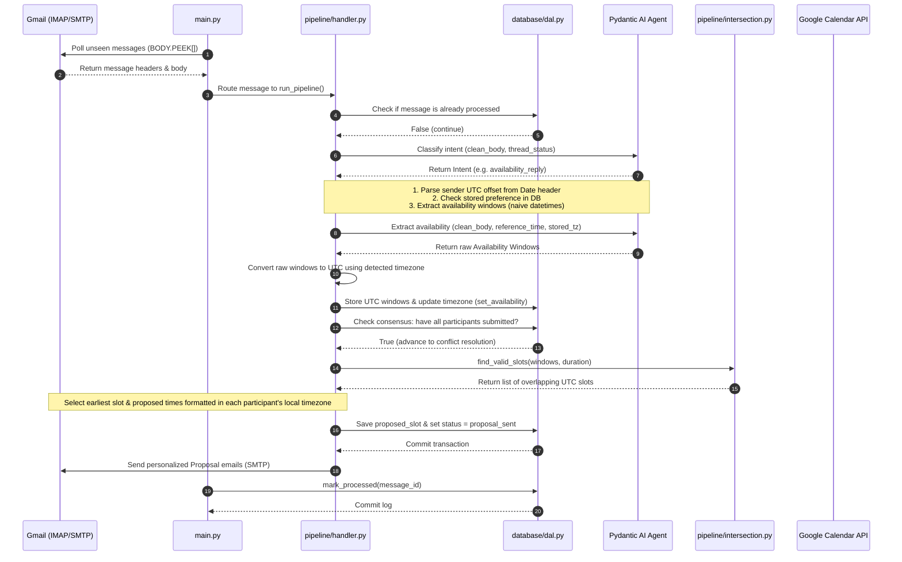

# 🤖 MailMind — Autonomous Email Scheduling Assistant

[](https://www.python.org/)
[](https://opensource.org/licenses/MIT)
[](#running-tests)
[](https://ai.pydantic.dev/)

MailMind is a fully autonomous, backend-only meeting scheduling assistant that runs entirely within email threads. It monitors a dedicated Gmail inbox, parses natural language availability from participants, resolves scheduling conflicts mathematically, collects consensus, and provisions Google Calendar events — **all without human intervention beyond the thread itself.**

No Calendly links, no Doodle polls, no external logins. Participants simply coordinate by replying to emails in plain English, and MailMind handles the logistics in their local timezones.

---

## 🗺️ Architectural Workflow

MailMind operates as a sequential polling process backed by SQLite. Below is the system sequence showing how an inbound email progresses from ingestion to event booking:



---

## ⚡ Key Features

* **Zero-Friction Integration**: Operates completely in-thread. No external web pages or applications are required for scheduling.
* **Automatic Timezone Detection**: Automatically reads UTC offset strings (e.g. `+0530`, `-0500`) from inbound email `Date` headers to resolve IANA timezone strings, falling back to standard `Etc/GMT` offsets.
* **Smart Natural Language Extraction**: Leverages Pydantic AI and Groq (`llama-3.1-8b-instant`) to extract complex, conversational availability (e.g. "free tomorrow afternoon", "busy Wednesday morning") and resolve them relative to processing timestamps.
* **Per-Participant Timezone Proposals**: Formats slot proposals and confirmations in each individual participant's local timezone so emails look human-written.
* **SMTP Bounce Resilience**: Automatically detects Google Mail Delivery Subsystem bounces, removes the invalid participant from the database roster, and recalculates consensus.
* **Robust Idempotency & Retries**: Follows a strict database-first commit sequence and marks Gmail messages as processed only after all pipeline steps run successfully, making transient API failure recovery safe.

---

## 🛠️ Technology Stack

* **Core Engine**: Python 3.11+
* **LLM Orchestration**: Pydantic AI
* **Inference Endpoint**: Groq API (`llama-3.1-8b-instant`)
* **Email Protocols**: `imaplib` (Secure Gmail IMAP) & `smtplib` (Secure SMTP via STARTTLS)
* **Calendar Provisioning**: Google Calendar API Client (`google-api-python-client`)
* **Persistence Layer**: SQLite (`sqlite3`) with a centralized Data Access Layer (DAL)
* **Testing Suite**: Pytest & Pytest-Mock

---

## 📁 Repository Layout

```
mailmind/
├── main.py                  # Polling entry point & reconnection manager
├── config.py                # Environment variable verification & typed constants
├── .env.example             # Configuration templates (copy to .env)
├── mailmind.db              # SQLite Database (generated on first run)
├── requirements.txt         # Package dependencies
│
├── agent/
│   ├── definitions.py       # Pydantic schemas (ClassificationResult, ExtractorResult)
│   ├── prompts.py           # Centralized registry of system prompts & email cores
│   ├── classifier.py        # Intent classification agent
│   ├── extractor.py         # Availability extraction agent
│   └── framing.py           # Outbound email natural-language framing manager
│
├── database/
│   ├── schema.py            # SQLite schema definitions
│   └── dal.py               # Centralized Data Access Layer (ALL raw SQL queries)
│
├── pipeline/
│   ├── handler.py           # Pipeline orchestrator
│   ├── consensus.py         # Consensus state machine & slot proposals
│   ├── intersection.py      # Mathematical slot conflict resolution
│   └── preprocessor.py      # Email text cleaner (signature & quote stripper)
│
├── tools/
│   ├── calendar.py          # Google Calendar event creator
│   ├── gmail_reader.py      # IMAP message fetcher (uses BODY.PEEK[])
│   └── gmail_sender.py      # SMTP message delivery
│
└── tests/                   # 150-test unit and integration test suite
```

---

## ⚙️ Setup & Installation

### 1. Clone & Set Up Environment
```bash
# Clone the repository
git clone https://github.com/RohitDSonawane/Mailmind.git
cd Mailmind

# Create a virtual environment
python -m venv .venv
source .venv/bin/activate  # On Windows: .venv\Scripts\activate

# Install dependencies
pip install -r requirements.txt
```

### 2. Configure Credentials
1. Copy `.env.example` to `.env` and fill in the required values:
   * **`GMAIL_ADDRESS`**: The scheduling assistant's email address.
   * **`GMAIL_APP_PASSWORD`**: A 16-character Gmail app-specific password (requires 2FA enabled on the account).
   * **`GROQ_API_KEY`**: Your Groq Console API key.
   * **`MEETING_DURATION_MINUTES`**: Target meeting duration (e.g. `60`).
   * **`POLL_INTERVAL_SECONDS`**: Polling frequency (e.g. `30`).
   * **`DEFAULT_TIMEZONE`**: Fallback IANA timezone string (e.g. `Asia/Kolkata`).
2. Download your Google OAuth client secrets file from the Google Cloud Console (configured for a **Desktop Application**), save it in the root directory, and name it **`credentials.json`**.

### 3. Run the Poller
```bash
python main.py
```
*On the first run, a browser window will open asking you to authorize the Google Calendar API. Once completed, a `token.json` file will be generated in the root, and subsequent runs will operate fully unattended.*

---

## 🧪 Running Tests

The test suite runs with fully isolated configurations, mock connection managers, and in-memory databases. It does not require a live internet connection or valid credentials:

```bash
pytest
```

---

## 📝 License

Distributed under the MIT License. See `LICENSE` for details.
